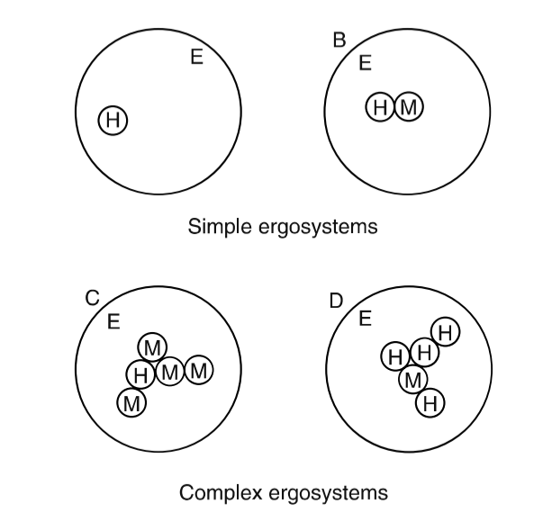
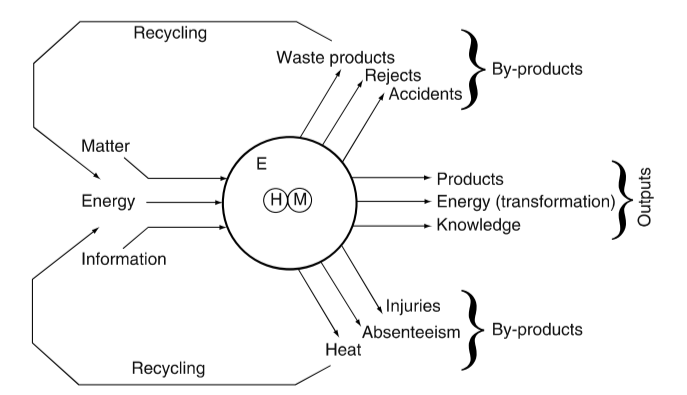

# Lecture-1

## Ergonomics

Ergonomics is the study of the **interaction between people and machines** and the **factors** that affect the interaction. Its purpose is to **improve the performance of systems** by improving human-machine interaction.

The implementation of ergonomics in system design should make the system work better by eliminating aspects of system functioning which are undesirable, uncontrolled or unaccounted for.

### Focus of Ergonomics

Since the the subject is a study of the **interaction**, the focus is on both the interaction and the **design of the interface**[^1] between people and machines.

## Human-Machine Systems

A **system** is a set of elements, the relation between these elements, and the boundary around them. Most systems consist of people and machines and perform a function to produce some form of output.

For ergonomics, the **human** is part of the system and must be fully integrated into it at the design stage. Human requirements are therefore **system requirements**, rather than secondary considerations.

### Compatibility: Matching Demands to Capabilities

**Compatibility** between the **user** and the **rest of the system** can be achieved at a number of levels. In order to achieve compatibility we need to asses the demands placed by technological and environmental constraints and weigh them against the capabilities of the users.

## Basic Work System

Even in a simple system consisting of one **person**, one **machine** and an **environment**, there're six directional interactions are possible:

$$
\begin{aligned}
H>M\quad H>E\\[2ex]
M>H\quad M>E\\[2ex]
E>H\quad E>M
\end{aligned}
$$

### Application of Ergonomics

The micro ergonomic task design involves one or more of

- design of the procedures
- design of the context
- design or selection of the task objects

The macro ergonomic task design involves one or more of

- design of work organization
- design of jobs
- optimal choice of technology
- work roles, communication and feedback

[^1]:
    **Interface**, the place at which independent and often unrelated systems meet and act on or communicate with each other